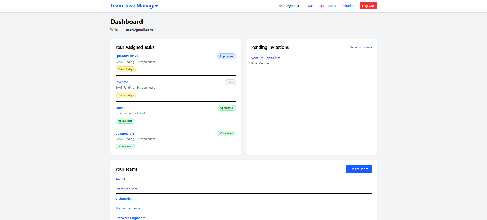
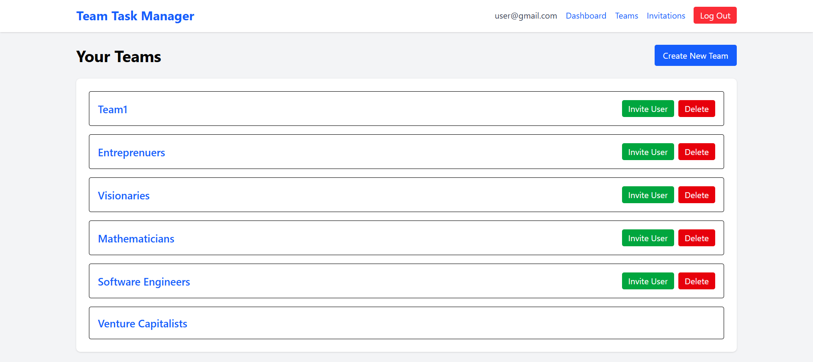
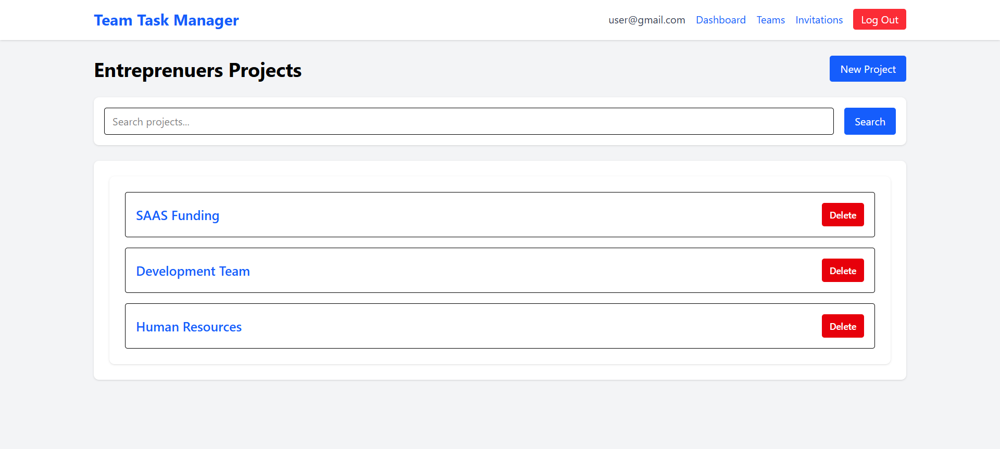
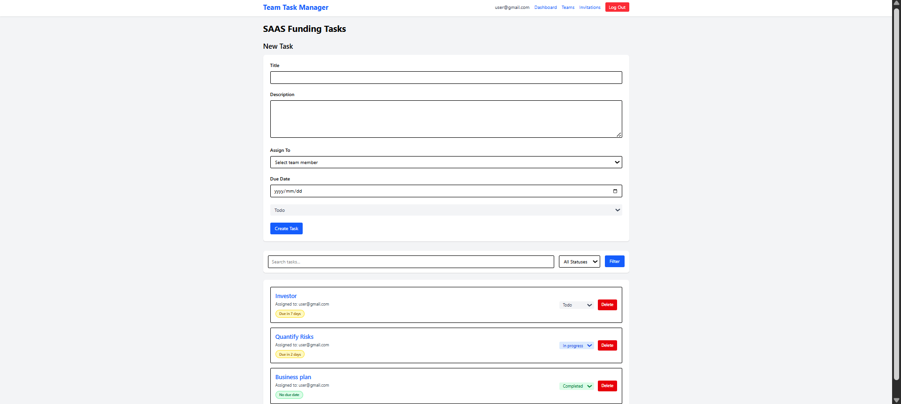
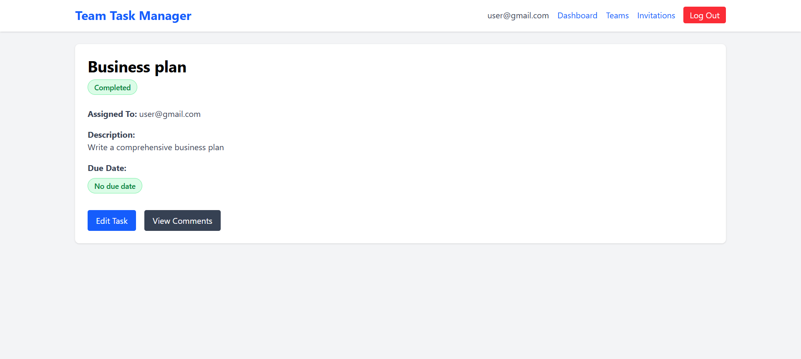
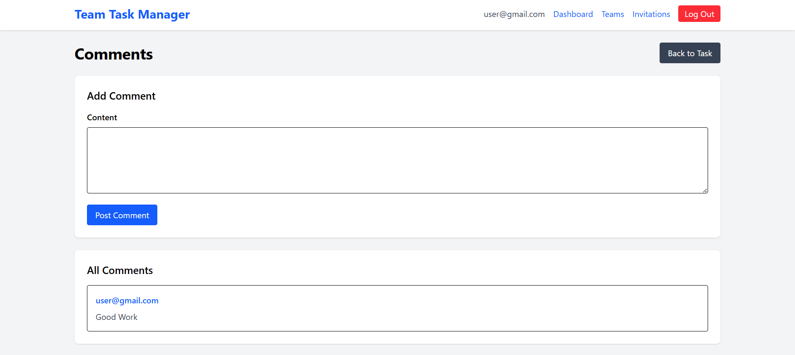
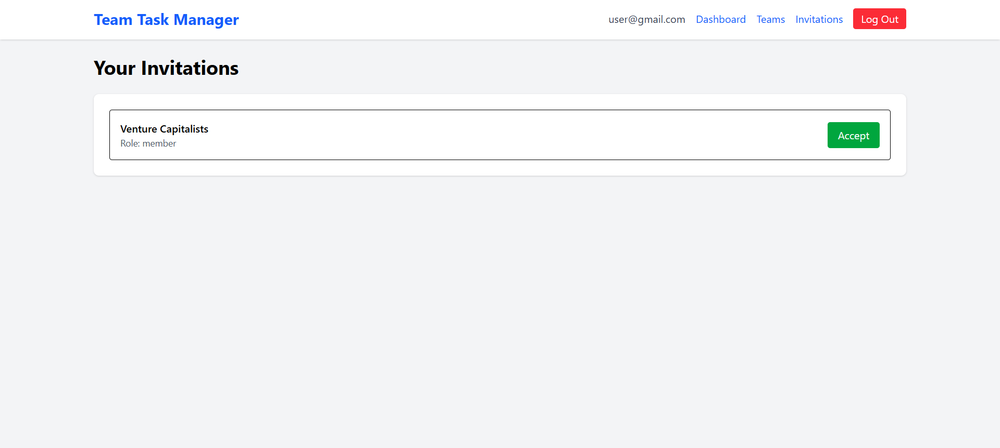
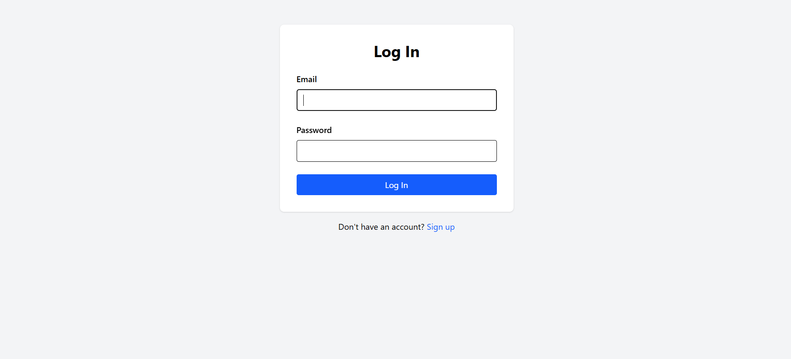
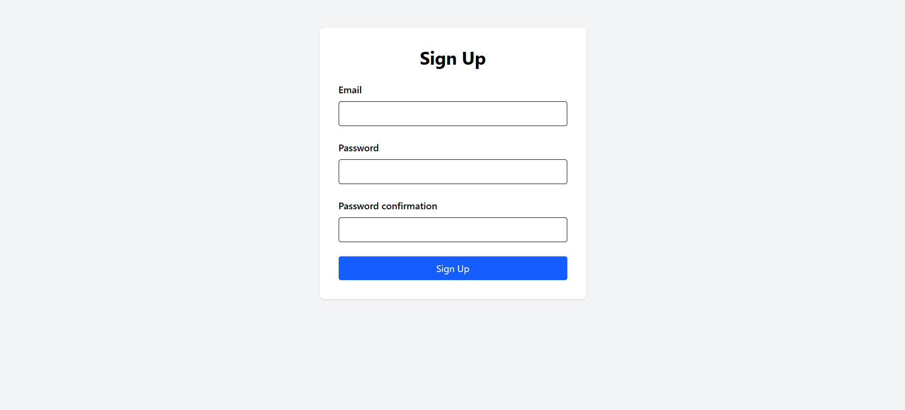
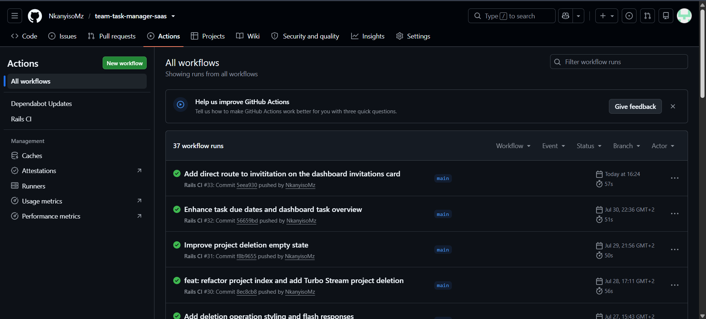

# Team Task Manager SaaS

A multi-tenant project management application inspired by tools like Trello and Asana.

The application enables teams to collaborate by managing projects, assigning tasks, commenting on work, and inviting members to shared workspaces. It demonstrates modern backend engineering practices including authentication, authorization, background job processing, containerized deployment, and CI/CD.

---

## Live Demo

🔗 https://team-task-manager-saas.onrender.com

## Screenshots

### Dashboard



### Teams



### Projects



### Tasks



### Task Details



### Collaboration & Comments



### Team Invitations



### Login Page



### Sign up Page



### CI/CD Pipeline



---

## Features

### Authentication & Authorization
- User authentication with Devise
- Role-based authorization (Admin / Member)
- Protected team and project access


### Collaboration
- Task comments
- Team invitations
- Invitation acceptance workflow
- Email notifications

### Multi-Tenancy
- Teams/workspaces
- Team memberships
- Scoped projects and tasks per organization

### Project Management
- Create and manage projects
- Create and manage tasks
- Task status tracking
- Task assignments
- Due dates
- Pagination and filtering


### Background Processing
- Redis integration
- Sidekiq background jobs
- Async email delivery with ActiveJob

### DevOps & Deployment
- Dockerized application
- Docker Compose setup
- CI/CD with GitHub Actions
- Production deployment on Render

---

## Tech Stack

### Backend
- Ruby 3.4.8
- Rails 7.1.6
- PostgreSQL

### Authentication
- Devise

### Background Jobs
- Sidekiq
- Redis

### Frontend
- ERB
- Tailwind CSS
- Turbo Streams

### DevOps
- Docker
- Docker Compose
- GitHub Actions
- Render

### Testing
- RSpec
- FactoryBot

---

## Backend Engineering Concepts Demonstrated

- MVC architecture
- Multi-tenant SaaS design
- Nested RESTful routing
- Background job processing
- Async workflows
- Role-based authorization
- Database associations
- CI/CD workflows
- Containerized deployment

---

## Main Models

- User
- Team
- Membership
- Project
- Task
- Comment
- Invitation

```text
User
├── Membership
│   └── Team
│       ├── Project
│       │   └── Task
│       │       └── Comment
│       └── Invitation
└── Assigned Tasks
```
---

## Application Workflow

1. Users sign up and log in
2. Admins create teams
3. Teams manage projects
4. Projects contain tasks
5. Team members collaborate through comments
6. Admins invite users via email
7. Invitation emails are queued using Sidekiq and processed asynchronously through ActiveJob.

---

## Local Development Setup

### Clone Repository

```bash
git clone https://github.com/NkanyisoMz/team-task-manager-saas.git
cd team-task-manager-saas
```

### Install Dependencies

```bash
bundle install
```

### Database Setup

```bash
rails db:create
rails db:migrate
```

### Start Redis

```bash
memurai
```

### Start Sidekiq

```bash
bundle exec sidekiq
```

### Start Rails Server

```bash
rails server
```

### Docker Setup
```bash
docker compose up
```

### Running Tests
```bash
bundle exec rspec
```

### Windows Users (Run Tailwind watcher)
```bash
rails tailwindcss:watch
```
---

## Future Improvements

- Real-time notifications with ActionCable
- File uploads
- Public REST API
- Activity tracking
- Advanced analytical dashboard

---

## Key Technical Challenges

During development, several engineering challenges were solved, including:

- Implementing multi-tenant authorization so users only access resources belonging to their teams.
- Using Turbo Streams to provide dynamic CRUD updates without writing custom JavaScript.
- Designing cascading deletion with Active Record associations.
- Optimizing dashboard queries using eager loading to avoid N+1 queries.
- Offloading email delivery to Sidekiq background jobs.

---

## Author

Nkanyiso Mzobe

GitHub: [NkanyisoMz GitHub](https://github.com/NkanyisoMz)
